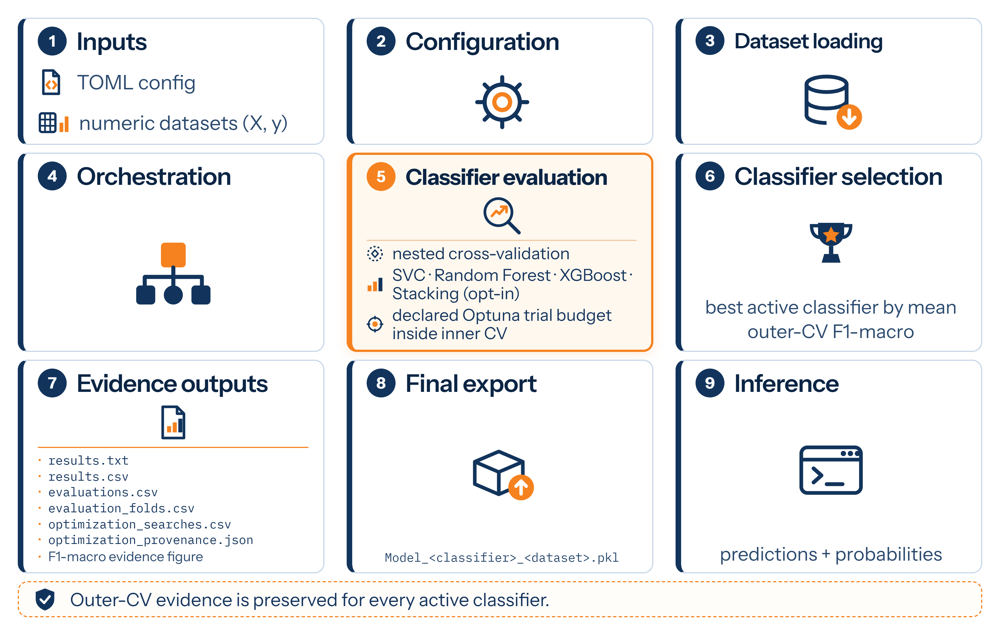

# MELITE — Multi-Model Classifier Evaluator

<section class="ms-hero">
  <div class="ms-hero__content">
    <p class="ms-eyebrow">Multi-model classifier evaluation</p>
    <div class="ms-brand" aria-label="MELITE">
      <span class="ms-brand__logo" aria-hidden="true">
        
      </span>
      <span class="ms-wordmark">MELITE</span>
    </div>
    <p class="ms-subtitle">
      Comparative classifier evaluation for reproducible classifier selection on numeric tabular data.
    </p>
    <div class="ms-actions">
      <a class="md-button md-button--primary" href="usage/">Usage</a>
      <a class="md-button" href="api/">API Reference</a>
      <a class="md-button" href="changelog/">Changelog</a>
    </div>
    <div class="ms-badges" aria-label="Project badges">
      <a href="https://github.com/NanoBiostructuresRG/melite/blob/main/LICENSE"></a>
      <a href="https://pypi.org/project/melite/"></a>
      <a href="https://pypi.org/project/melite/"></a>
      <a href="https://github.com/NanoBiostructuresRG/melite/actions/workflows/ci.yml"></a>
    </div>
  </div>
</section>

!!! note "Pre-stable"
    MELITE is currently in alpha-stage development.

## Why MELITE?

Comparing classifiers is easy. Keeping the comparison methodologically sound
and reconstructable is harder.

You tune several classifiers, compare their scores, and choose one. Later comes
the question: why this classifier? Answering it depends on two things that are
easy to lose — whether tuning stayed clear of the evidence used to report
performance, and whether the fold-level results still exist.

MELITE turns that decision into a recorded evaluation workflow. Hyperparameter
search stays inside the training portion of each outer split, while performance
is measured on held-out outer folds. Classifier selection is based on mean
outer-CV F1-macro, and both aggregate and fold-level evidence are persisted.
For tunable classifiers, search effort is controlled by an explicitly declared
optimization budget, making that effort part of the recorded evaluation
design.

Selection and final fitting are deliberately separate. Outer-CV evidence
identifies the winning classifier; the final artifact is then fitted on all
available data, with a final full-data search when the classifier is tunable.
The outer-CV score estimates performance; the exported artifact is the
deliverable. MELITE reports them as distinct.

You can assemble the same procedure manually with scikit-learn and the
underlying estimator libraries. MELITE makes it explicit, repeatable, and
inspectable — and keeps the evidence.

## Evaluation Workflow



## What You Provide and Receive

MELITE sits between prepared numeric datasets and the fitted model you
ultimately export. A typical workflow has the following contract:

| Stage | You provide | MELITE does | You receive |
|---|---|---|---|
| **Input** | Numeric feature matrices (`X`) and target labels (`y`) for one or more datasets. | Validates each registered dataset and treats it as an independent evaluation unit. | Validated datasets, ready for evaluation. |
| **Configuration** | Active classifiers, cross-validation settings, dataset metadata, and output paths. | Resolves the evaluation design before classifier fitting begins. | A validated evaluation setup. |
| **Evaluation** | Nothing further — the evaluation design is already fixed. | Evaluates each active classifier under the same outer cross-validation design. Tunable classifiers perform hyperparameter search only within the training portion of each outer split. | `evaluations.csv`, aggregate evidence for every evaluated classifier; `evaluation_folds.csv`, the corresponding outer-fold evidence; `optimization_searches.csv`, the completed-search evidence; and `optimization_provenance.json`, the effective optimization and evaluation contract. |
| **Selection** | The evaluation evidence produced by the run. | Selects the classifier with the highest mean outer-CV F1-macro for each dataset. | `results.csv`, the selected classifier result for each dataset, and `evaluation_f1_macro_<dataset>.png`, the visual evidence behind the selection. |
| **Export** | A request to export a selected result. | Fits the selected classifier on all available data using the classifier parameters persisted in `results.csv` by `melite run`; no additional hyperparameter search, cross-validation, or classifier selection is performed. | `Model_<classifier>_<dataset>.pkl`, a fitted model artifact distinct from the estimators used to obtain the outer-CV evidence. |


## Citation


```text
Contreras-Torres, F. F., & Murrieta, A. C. (2026). MELITE — Multi-Model Classifier Evaluator. Zenodo. https://doi.org/10.5281/zenodo.20382752
```

Use [CITATION.cff](https://github.com/NanoBiostructuresRG/melite/blob/main/CITATION.cff) as the authoritative machine-readable citation metadata for MELITE. Citation metadata is updated with each release.


## License

MELITE is licensed under the
[GNU Lesser General Public License v3.0 or later](https://github.com/NanoBiostructuresRG/melite/blob/main/LICENSE). SPDX identifier: `LGPL-3.0-or-later`.
